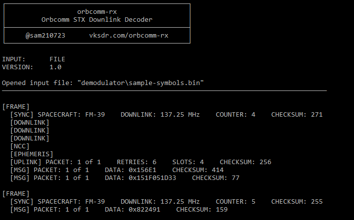

# 📡 orbcomm-rx - STX Demodulator and Decoder
**orbcomm-rx** is a demodulator and decoder for the Orbcomm VHF [Subscriber Transmitter (STX)](https://www.sigidwiki.com/wiki/Orbcomm) downlink. Each satellite in the Orbcomm constellation transmits two STX carriers between 137-138 MHz. These downlinks contain satellite position data, orbital elements, uplink/downlink channel info, and encrypted user messages.

## Demodulator
The STX downlinks are modulated using Symmetrical Differential Phase Shift Keying (SDPSK) at a data rate of 4.8 kbps.

## Decoder

## Resources
  - [“Ever wondered what is on the Orbcomm Satellite Downlink?”](http://mdkenny.customer.netspace.net.au/Orbcomm.pdf) - Mike Kenny
  - ["The Orbcomm Experience"](https://artes.esa.int/sites/default/files/1_The_Orbcomm_Experience.pdf) - Jochen Harms
