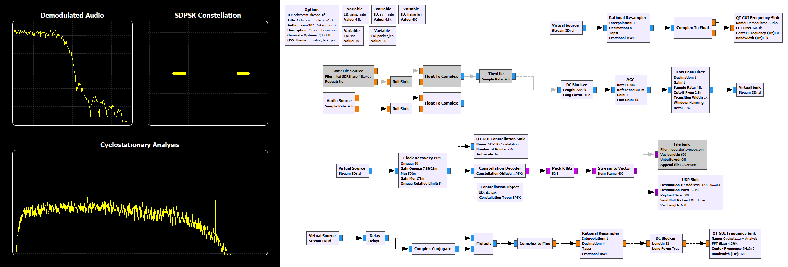

# Orbcomm RX
Orbcomm Subscriber Transmitter (STX) downlink demodulator and decoder.

## Demodulator

## Resources
[“Ever wondered what is on the Orbcomm Satellite Downlink?”](http://mdkenny.customer.netspace.net.au/Orbcomm.pdf) - Mike Kenny
["The Orbcomm Experience"](https://artes.esa.int/sites/default/files/1_The_Orbcomm_Experience.pdf) - Jochen Harms
